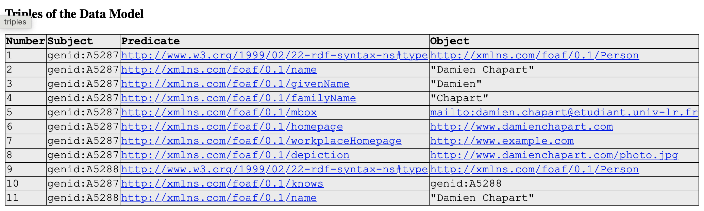

# TP 1

## Exercice 1

### Consignes

Créer son fichier foaf.rdf et l’associer à sa page « homepage » web (page de
présentation).
Déposer sur github (cf annexe)
(cerise sur le gateau valider sa homepage par le validateur du w3c
« https://www.w3.org/RDF/Validator/ »)

### Réalisation

  le fichier `foaf.rdf` contient les informations suivantes:
  ```xml
  <?xml version="1.0" encoding="UTF-8"?>
<rdf:RDF xmlns:rdf="http://www.w3.org/1999/02/22-rdf-syntax-ns#"
         xmlns:rdfs="http://www.w3.org/2000/01/rdf-schema#"
         xmlns:foaf="http://xmlns.com/foaf/0.1/">

  <foaf:Person>
    <foaf:name>Damien Chapart</foaf:name>
    <foaf:givenName>Damien</foaf:givenName>
    <foaf:familyName>Chapart</foaf:familyName>
    <foaf:mbox rdf:resource="mailto:damien.chapart@etudiant.univ-lr.fr"/>
    <foaf:homepage rdf:resource="http://www.damienchapart.com"/>
    <foaf:workplaceHomepage rdf:resource="http://www.example.com"/>
    <foaf:depiction rdf:resource="http://www.damienchapart.com/photo.jpg"/>
    <foaf:knows>
      <foaf:Person>
        <foaf:name>Damien Chapart</foaf:name>
      </foaf:Person>
    </foaf:knows>
  </foaf:Person>

</rdf:RDF>
```

Il a été vérifier avec le validateur [en ligne de W3C](https://www.w3.org/RDF/Validator/rdfval) et il est valide.



ensuite, j'ai ecire l'`index.html` pour afficher les informations de ce fichier rdf.

ensuite, j'ai utilisé le workflow github pour deployer le site sur github pages.

#### Le status du workflow est le suivant:


#### Le site est disponible sur:
    
> Disponible sur [github pages](https://damchap.github.io/FOAF/)


## Exercice 2

### Consignes
Faire une transformation xsl pour visualiser en xhtml la page foaf.rdf. Ecrire au tableau
l’URL de votre page foaf.rdf et ajouter des références aux autres pages (Connaissances).

### Réalisation

J'ai créé un fichier `foaf.xsl` pour transformer le fichier `foaf.rdf` en `foaf.html`.

```xml
## Exercice 3
Créer un compte sur ORCID et utiliser curl pour récupérer les éléments de votre compte
(en particulier avec les éléments foaf)
## Exercice 4
Utiliser le moteur ldspider pour « crawler » vos pages et/ou « http://sixhills-
consulting.com/foaf/agueritz/foaf.rdf » pour découvrir d’autres personnes foaf. Conserver
le résultat du crawling pour la suite. (On pourra utiliser tinyproxy pour simplifier l’utilisation
du web sur les vm en salle réseau MSI)